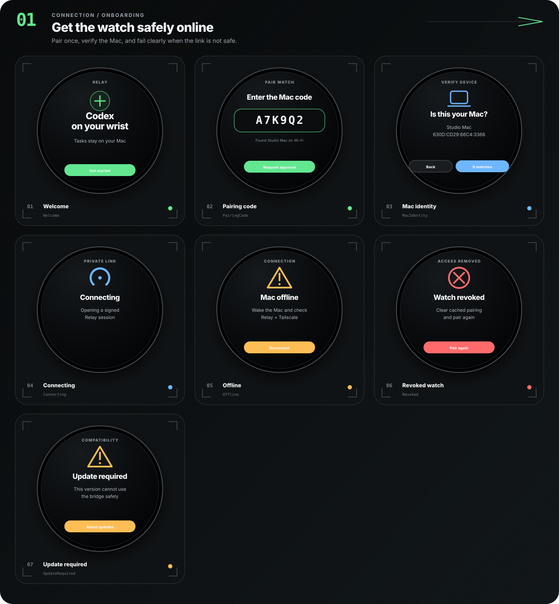
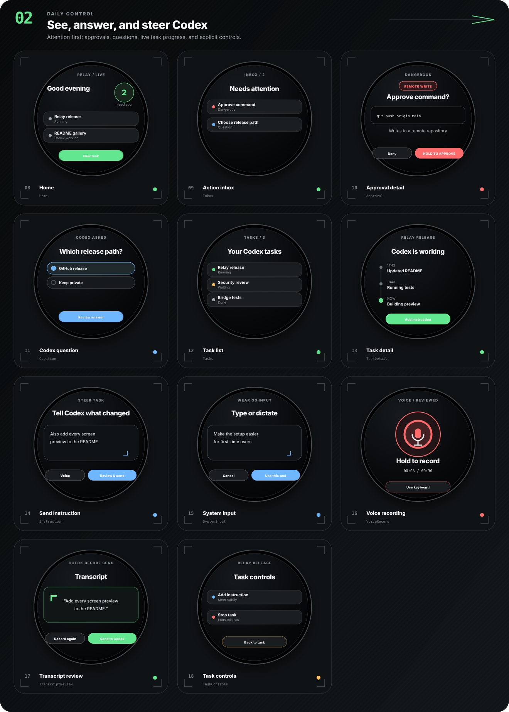
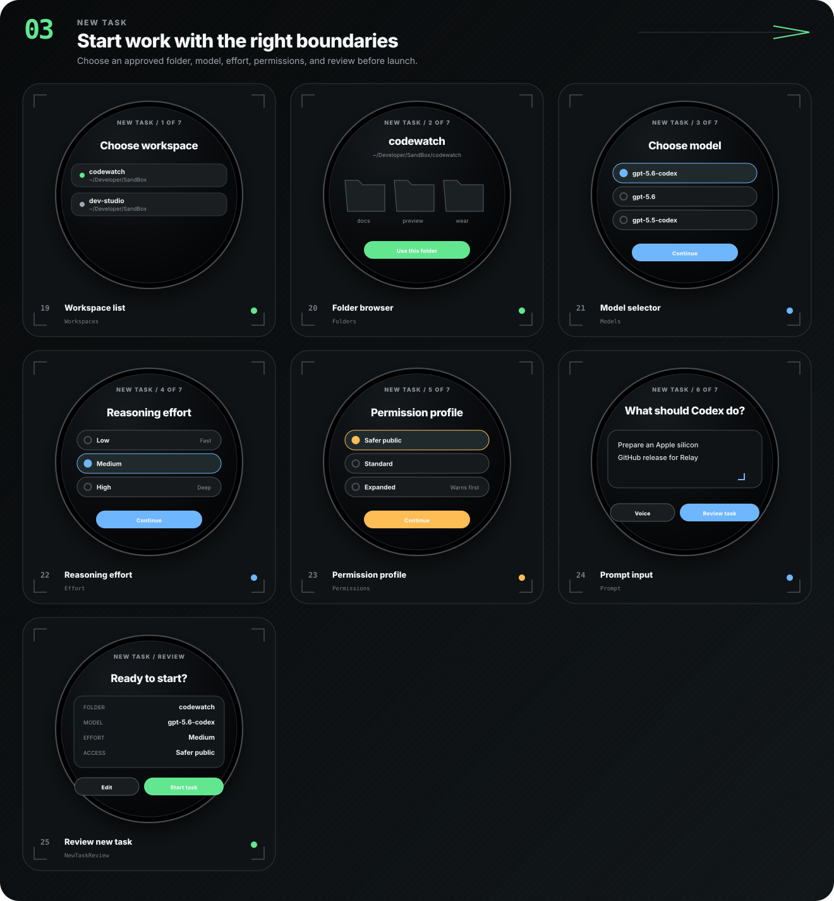
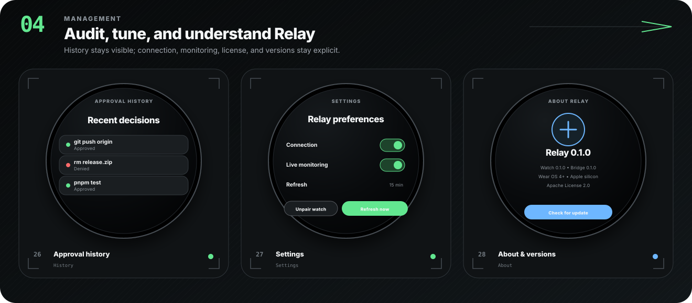

# Relay

Relay lets a Wear OS watch talk to and control Codex tasks running on an
Apple-silicon Mac.

The user installs only three things:

1. Codex on the Mac.
2. Relay on the Mac from a notarized DMG.
3. Relay for Wear OS from Google Play.

The Mac opens one outbound connection to Relay Cloud. The watch works over
Wi-Fi or LTE without Tailscale, Wireless ADB, port forwarding, an emulator, or
a required phone companion. Relay Cloud routes encrypted envelopes but cannot
decrypt prompts, commands, workspace paths, approvals, task output, or voice.

> **Current checkpoint:** `main` contains the cloud Worker and D1 foundation,
> passwordless invite login, native Mac tunnel, E2EE watch pairing, encrypted
> Wear OS requests, revocation, Emergency Stop, account deletion, and automated
> release gates. The Phase-2 Apple Watch target now has Cloud pairing and an
> encrypted request tunnel, but its destination screens and physical TestFlight
> flow remain unfinished. A public beta still requires production accounts, signing
> material, deployment, store review, physical devices, testers, and an external
> security review.

Relay is local-first, telemetry-free, and licensed under Apache License 2.0.

## See the UI now

The browser preview is a clickable model of the native screens:

```bash
cd preview
python3 -m http.server 4173
```

Open [http://127.0.0.1:4173](http://127.0.0.1:4173). The preview needs no
account and sends no data.

## All 28 Wear OS screens

### 01 — Connection and onboarding



### 02 — Daily control



### 03 — New task



### 04 — Management



Rebuild the SVG boards with `pnpm generate:readme-screens`.

## What is implemented

### Wear OS

- native Kotlin and Compose app for Wear OS 3/API 30 and newer;
- round/square layouts, rotary and touch input, accessibility labels, and safe
  clipped-edge spacing;
- six-character cloud pairing, Mac/watch fingerprint comparison, and Mac
  approval;
- separate P-256 signing and key-agreement identities;
- Android Keystore ECDH on API 31+, with encrypted software P-256 fallback on
  API 30;
- encrypted signed requests for tasks, inbox, approvals, questions,
  instructions, workspace selection, new tasks, and reviewed voice;
- 128 KiB encrypted voice chunks, assembled only on the Mac, with a 2 MiB and
  30-second hard limit;
- offline, stale, revoked, reconnecting, and update-required states;
- pushed end-to-end encrypted events, battery-aware snapshot reconciliation,
  and time-limited Live Monitoring.

### Mac

- native SwiftUI menu-bar application for macOS 14+ on Apple silicon;
- embedded arm64 bridge sidecar, loopback-only admin API, and Keychain secrets;
- passwordless email sign-in with PKCE and rotating refresh tokens;
- outbound authenticated cloud tunnel with reconnect and heartbeat;
- E2EE pairing approval, workspace policy, device revocation, Emergency Stop,
  account deletion, Login Item control, and redacted diagnostics;
- Sparkle 2 stable/beta updates, hardened runtime, Developer ID packaging, and
  notarized DMG workflow.

### Relay Cloud

- Cloudflare Worker REST API, D1 repository, and one hibernating Durable Object
  router per account;
- invite-only accounts and Resend single-use magic links;
- encrypted email storage, hashed lookup values, hashed refresh/host/watch
  credentials, expiry purge jobs, and generic authentication errors;
- E2EE pairing completion: only the watch can decrypt its approved credential;
- cross-account/host isolation, no offline action queue, live revocation, and
  credential-rotating Emergency Stop;
- no product analytics, advertising SDKs, or plaintext content logging.

## Architecture

```text
Wear OS app
  └─ signed request inside AES-256-GCM envelope
       └─ Relay Cloud Durable Object (ciphertext routing only)
            └─ outbound Relay Mac tunnel
                 └─ loopback Relay bridge
                      ├─ Codex app-server
                      ├─ approved Mac folders
                      └─ optional temporary transcription
```

The Mac must remain awake, online, and running Relay and Codex. Relay Cloud does
not run Codex and does not store OpenAI credentials.

## Start here

- User setup: [docs/SETUP.md](docs/SETUP.md)
- Supported hardware: [docs/COMPATIBILITY.md](docs/COMPATIBILITY.md)
- Security model: [docs/SECURITY.md](docs/SECURITY.md)
- Physical Wear testing: [docs/PHYSICAL-WATCH-TEST.md](docs/PHYSICAL-WATCH-TEST.md)
- Release gates: [docs/TODO.md](docs/TODO.md)
- Maintainer release process: [docs/RELEASE.md](docs/RELEASE.md)
- Apple Watch Phase 2: [apple-watch/README.md](apple-watch/README.md)

## Developer quick start

```bash
corepack enable
pnpm install --frozen-lockfile
pnpm test
pnpm typecheck

export JAVA_HOME="/Applications/Android Studio.app/Contents/jbr/Contents/Home"
export ANDROID_HOME="$HOME/Library/Android/sdk"
export DEVELOPER_DIR="/Applications/Xcode.app/Contents/Developer"
./gradlew :wear:testDebugUnitTest :wear:lintDebug :wear:assembleDebug

pnpm build:bridge-sea
xcrun swift test --package-path mac
xcrun swift run --package-path mac RelayMac

env WRANGLER_LOG_PATH=/tmp/relay-wrangler.log \
  pnpm --filter @relay/cloud build
```

No emulator or Wear OS system image is required. Installing a debug APK on a
physical watch still uses Android Studio or ADB as a developer-only workflow;
beta users install from Google Play.

## License

Relay is licensed under [Apache License 2.0](LICENSE). See [NOTICE](NOTICE) and
[THIRD_PARTY_NOTICES.md](THIRD_PARTY_NOTICES.md).
