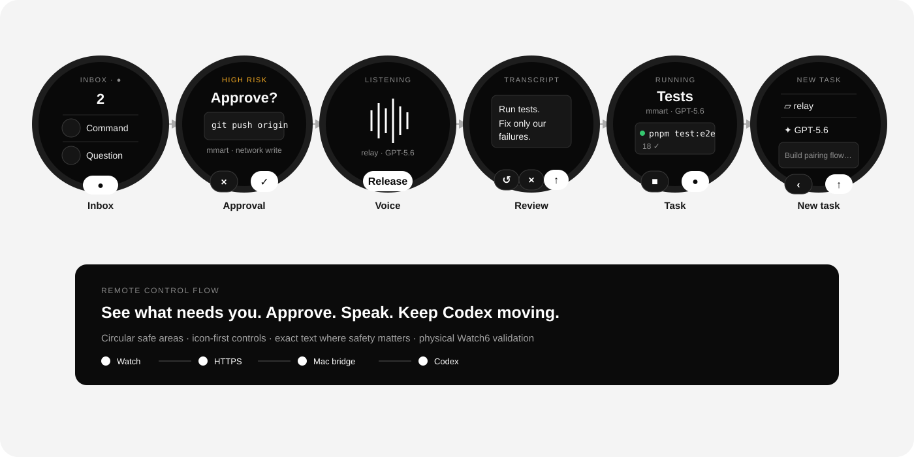

# Relay

Relay is a native Wear OS remote for Codex tasks already running on a Mac. It is designed for a Samsung Galaxy Watch6 using Wi-Fi, with no Android phone and no emulator required.

The MVP lets the watch:

- monitor existing Codex tasks and their latest activity;
- approve or deny every Codex approval request with one tap;
- answer Codex questions;
- record an instruction, transcribe it through OpenAI speech-to-text, review it, and send it;
- browse Mac folders, select a model and reasoning effort, and start a task;
- stop or steer a running task;
- inspect a local approval history.

## Watch flow

<p align="center">
  
</p>

<details>
  <summary><strong>Screen sequence</strong></summary>

  <table>
    <thead>
      <tr>
        <th>Step</th>
        <th>Screen</th>
        <th>Purpose</th>
      </tr>
    </thead>
    <tbody>
      <tr><td>1</td><td>Inbox</td><td>See approvals and questions blocking Codex.</td></tr>
      <tr><td>2</td><td>Approval</td><td>Inspect the exact command and approve or deny once.</td></tr>
      <tr><td>3</td><td>Voice</td><td>Hold to record an instruction for the active task.</td></tr>
      <tr><td>4</td><td>Review</td><td>Check the transcript before it is sent.</td></tr>
      <tr><td>5</td><td>Task</td><td>Monitor activity, stop work, or steer by voice.</td></tr>
      <tr><td>6</td><td>New task</td><td>Choose a Mac folder and Codex model, then start.</td></tr>
    </tbody>
  </table>
</details>

## Architecture

```text
Galaxy Watch6
    │ HTTPS + WebSocket, paired-device authentication
    ▼
Tailscale Funnel
    │ TLS termination; forwards only to localhost
    ▼
Relay Mac bridge
    ├── Codex app-server (existing desktop tasks)
    ├── OpenAI speech-to-text
    ├── Mac folder browser
    └── local audit database
```

The bridge is the trust boundary. OpenAI and Codex credentials never live on the watch. The bridge listens only on `127.0.0.1`; Funnel provides the internet-facing TLS endpoint.

## Start here

1. Complete [docs/SETUP.md](docs/SETUP.md).
2. Work through [docs/TODO.md](docs/TODO.md).
3. Review the approved design in [docs/superpowers/specs/2026-07-22-relay-design.md](docs/superpowers/specs/2026-07-22-relay-design.md).
4. Read [docs/SECURITY.md](docs/SECURITY.md) before enabling remote approvals.

## Current status

The repository contains a runnable Relay MVP:

- native Kotlin/Compose Wear OS application in `wear/`;
- localhost-only Node 24 Mac bridge in `apps/bridge/`;
- generated bindings for the installed Codex app-server protocol;
- public-key watch pairing and signed-request replay protection;
- live Codex task/model discovery, approvals, questions, instructions, steering, and stop APIs;
- physical-watch-only build and deployment workflow.

Automated tests, Android lint, APK assembly, and a live Codex task/model smoke
test pass. Physical Watch6 installation and interaction QA remain pending until
the reset watch is paired to ADB. Voice upload/transcription, resumable
WebSocket delivery, Funnel ingress, and release signing remain tracked in
`docs/TODO.md`; the current build uses authenticated HTTP polling over
`adb reverse` for its safe local development loop.

Build the APK with:

```bash
./gradlew :wear:assembleDebug
```

Follow [docs/PHYSICAL-WATCH-TEST.md](docs/PHYSICAL-WATCH-TEST.md) to connect and install on a Galaxy Watch6.
